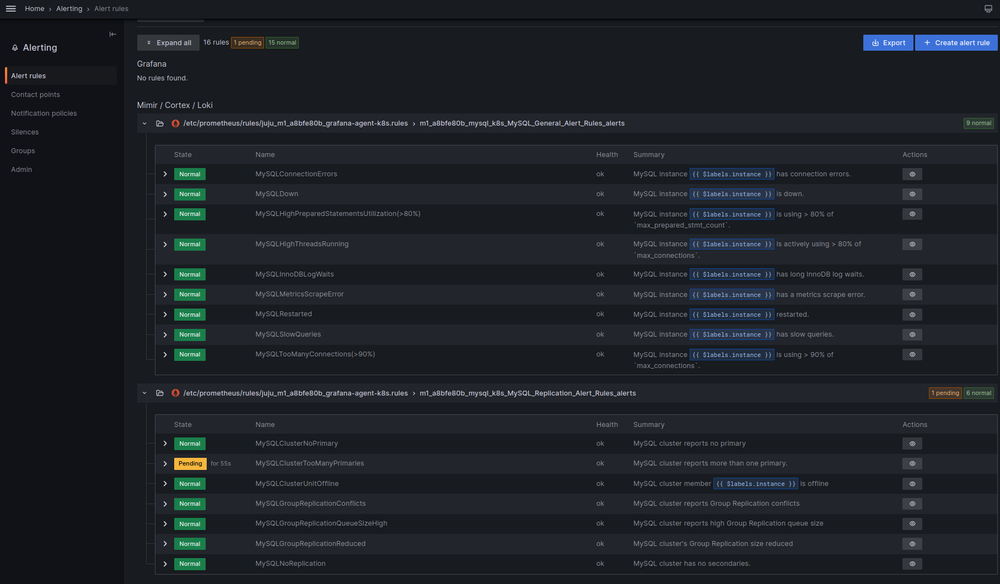
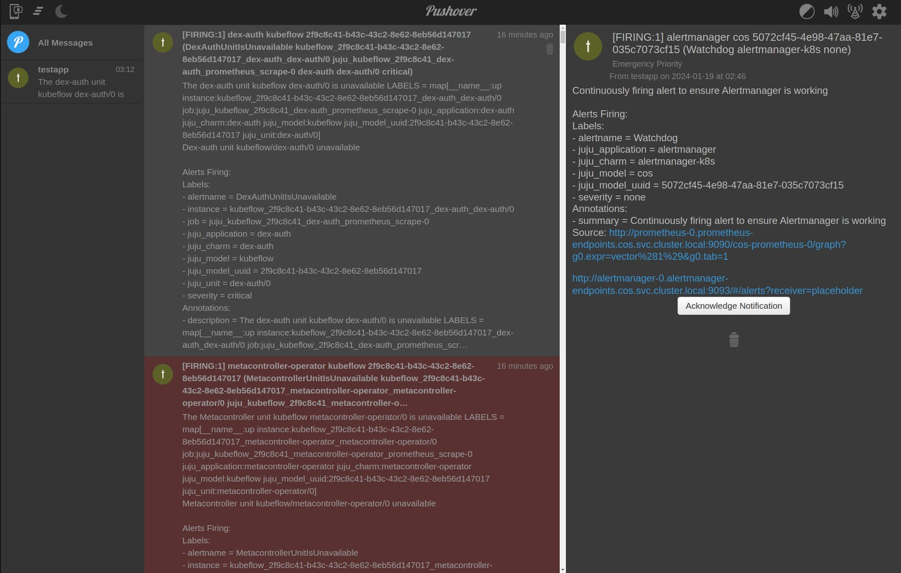

---
myst:
  html_meta:
    description: "Configure COS alert notifications for Charmed MySQL using AlertManager with Pushover, including credentials setup and receiver configuration."
---

(enable-alert-rules)=
# How to enable alert rules

Charmed MySQL ships a pre-configured and pre-enabled list of Awesome Alert Rules.

<details><summary>Screenshot
</summary>


</details>

This guide will show how to set up [Pushover](https://pushover.net/) to receive alert notifications from the COS Alert Manager with [Awesome Alert Rules](https://samber.github.io/awesome-prometheus-alerts/).

```{seealso}
* {ref}`alert-rules`
* [Observability documentation > Add alert rules](https://documentation.ubuntu.com/observability/latest/how-to/adding-alert-rules/)
```

## Prerequisites

* Fully configured monitoring with COS
  * See {ref}`enable-monitoring`

---

## Enable COS alerts for Pushover

The following section is an example of the [Pushover](https://pushover.net/) alerts aggregator.

The first step is to create a new account on Pushover (or use an existing one). The goal is to have the 'user key' and 'token' to authorize alerts for the Pushover application. Follow this straightforward [Pushover guide](https://support.pushover.net/i175-how-to-get-a-pushover-api-or-pushover-application-token).

Next, create a new [COS Alert Manager](https://charmhub.io/alertmanager-k8s) config (replace `user_key` and `token` with yours):

```shell
cat > myalert.yaml << EOF
```

```yaml
global:
  resolve_timeout: 5m
  http_config:
    follow_redirects: true
    enable_http2: true
route:
  receiver: placeholder
  group_by:
  - juju_model_uuid
  - juju_application
  - juju_model
  continue: false
  group_wait: 30s
  group_interval: 5m
  repeat_interval: 1h
receivers:
- name: placeholder
  pushover_configs:
    - user_key: <replace_with_your_user_key>
      token: <replace_with_your_token>
      url: http://<replace_with_grafana_public_ip>/cos-grafana/alerting/list
      title: "{{ range .Alerts }}{{ .Labels.severity }} - {{ if .Labels.juju_unit }}{{ .Labels.juju_unit }}{{ else }}{{ .Labels.juju_application }}{{ end }} in model {{ .Labels.juju_model }}: {{ .Labels.alertname }} {{ end }}"
      message: "{{ range .Alerts }} Job: {{ .Labels.job }} Instance: {{ .Labels.instance }} {{ end }}"
templates: []
EOF
```

Upload and apply newly the created alert manager config:

```shell
juju switch <k8s_cos_controller>:<cos_model_name>
juju config alertmanager config_file=@myalert.yaml
```

At this stage, the COS Alert Manager will start sending alert notifications to Pushover. Users can receive them on all supported [Pushover clients/apps](https://pushover.net/clients).

<details><summary>Screenshot
</summary>


</details>

```{note}
Some alert rules use `for: 0m`, but may still appear delayed. This is because Prometheus evaluates alert rules at intervals (configured via [`evaluation_interval`](https://charmhub.io/prometheus-k8s/configurations#evaluation_interval), typically every minute) and depends on fresh data scraped at its own intervals (default: 1 min). As a result, the best-case alert delay is: **scrape interval + evaluation interval**.
```

## Other alert receivers

In a similar way to the COS Alert Manager, alerts can be send to [several other supported receivers](https://prometheus.io/docs/alerting/latest/configuration/#receiver-integration-settings).

Do you have questions? {ref}`Contact us <contacts>!
