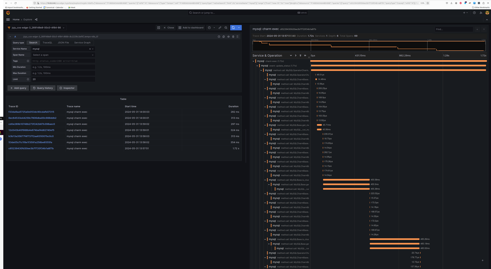

---
myst:
  html_meta:
    description: "Enable Grafana Tempo distributed tracing for Charmed MySQL (development preview) by deploying Tempo HA and integrating via cross-model offers."
---

(enable-tracing)=
# Enable tracing

This guide contains the steps to enable tracing with [Grafana Tempo](https://grafana.com/docs/tempo/latest/) for your MySQL application. 

```{caution}
This is feature is in development. It is **not recommended** for production environments. 
```

## Prerequisites

* Charmed MySQL for machines: Revision 237+ or
* Charmed MySQL for Kubernetes: Revision 146+
  * See [](/how-to/refresh/index)
* Fully configured monitoring with COS
  * See {ref}`enable-monitoring`

---

## Deploy Tempo

First, switch to the Kubernetes controller where the COS model is deployed:

```shell
juju switch <k8s_controller_name>:<cos_model_name>
```

Then, deploy the dependencies of Tempo following [this tutorial](https://discourse.charmhub.io/t/tutorial-deploy-tempo-ha-on-top-of-cos-lite/15489). 

To summarize:
* Deploy the MinIO charm
* Deploy the s3 integrator charm
* Add a bucket in MinIO using a python script
* Configure s3 integrator with the MinIO credentials

Finally, deploy and integrate with Tempo HA in [a monolithic setup](https://discourse.charmhub.io/t/tutorial-deploy-tempo-ha-on-top-of-cos-lite/15489).

## Offer interfaces

Next, offer interfaces for cross-model integrations from the model where Charmed MySQL is deployed.

To offer the Tempo integration, run

```shell
juju offer <tempo_coordinator_k8s_application_name>:tracing
```

Then, switch to the Charmed MySQL VM model, find the offers, and integrate (relate) with them:

```shell
juju switch <mysql_controller_name>:<mysql_model_name>

juju find-offers <k8s_controller_name>:  
```
> Do not miss the "`:`" in the command above!

Below is a sample output where `k8s` is the K8s controller name and `cos` is the model where `cos-lite` and `tempo-k8s` are deployed:

```shell
Store  URL                            Access  Interfaces
k8s    admin/cos.tempo                admin   tracing:tracing
```

Next, consume this offer so that it is reachable from the current model:

```shell
juju consume k8s:admin/cos.tempo
```

## Consume interfaces

First, deploy [Grafana Agent](https://charmhub.io/grafana-agent) from the `1/stable` channel:

```shell
juju deploy grafana-agent --channel 1/stable
```

Then, integrate Grafana Agent with Charmed MySQL:
```
juju relate mysql:cos-agent grafana-agent:cos-agent
```

Finally, integrate Grafana Agent with the consumed interface from the previous section:
```shell
juju relate grafana-agent:tracing tempo:tracing
```

Wait until the model settles. The following is an example of the `juju status --relations` on the Charmed MySQL model:

````{tab-set}
```{tab-item} VM
:sync: vm

    Model     Controller  Cloud/Region         Version  SLA          Timestamp
    mysql     lxd         localhost/localhost  3.5.4    unsupported  19:15:55Z

    SAAS   Status  Store       URL
    tempo  active  k8s         admin/cos.tempo

    App            Version          Status   Scale  Charm          Channel      Rev  Exposed  Message
    grafana-agent                   blocked      1  grafana-agent  1/stable     452  no       Missing ['grafana-cloud-config']|['grafana-dashboards-provider']|['logging-consumer']|['send-remote-write'] for cos-a...
    mysql          8.4.7            active       1  mysql                            no       

    Unit                Workload  Agent  Machine  Public address  Ports           Message
    mysql/0*            active    idle   0        10.205.193.32   3306,33060/tcp  Primary
      grafana-agent/0*  blocked   idle            10.205.193.32                   Missing ['grafana-cloud-config']|['grafana-dashboards-provider']|['logging-consumer']|['send-remote-write'] for cos-a...

    Machine  State    Address        Inst id        Base          AZ  Message
    0        started  10.205.193.32  juju-4f3e50-0  ubuntu@24.04      Running

    Integration provider  Requirer                 Interface              Type         Message
    grafana-agent:peers   grafana-agent:peers      grafana_agent_replica  peer         
    mysql:cos-agent       grafana-agent:cos-agent  cos_agent              subordinate  
    mysql:database-peers  mysql:database-peers     mysql_peers            peer         
    mysql:restart         mysql:restart            rolling_op             peer         
    mysql:upgrade         mysql:upgrade            upgrade                peer         
    tempo:tracing         grafana-agent:tracing    tracing                regular  
```
```{tab-item} K8s
:sync: k8s

    Model     Controller  Cloud/Region        Version  SLA          Timestamp
    mysql     k8s         microk8s/localhost  3.5.4    unsupported  16:33:26Z

    SAAS   Status  Store       URL
    tempo  active  k8s         admin/cos.tempo

    App                Version    Status  Scale  Charm              Channel      Rev  Address         Exposed  Message
    grafana-agent-k8s  0.40.4     active      1  grafana-agent-k8s  1/stable     115  10.152.183.63   no       grafana-dashboards-provider: off, logging-consumer: off, send-remote-write: off
    mysql-k8s          8.4.7      active      1  mysql-k8s                            10.152.183.135  no       Primary

    Unit                  Workload  Agent      Address       Ports  Message
    grafana-agent-k8s/0*  active    idle       10.1.241.255         grafana-dashboards-provider: off, logging-consumer: off, send-remote-write: off
    mysql-k8s/0*          active    executing  10.1.241.253         Primary

    Integration provider                Requirer                   Interface              Type     Message
    grafana-agent-k8s:peers             grafana-agent-k8s:peers    grafana_agent_replica  peer     
    grafana-agent-k8s:tracing-provider  mysql-k8s:tracing          tracing                regular  
    mysql-k8s:database-peers            mysql-k8s:database-peers   mysql_peers            peer     
    mysql-k8s:restart                   mysql-k8s:restart          rolling_op             peer     
    mysql-k8s:upgrade                   mysql-k8s:upgrade          upgrade                peer     
    tempo:tracing                       grafana-agent-k8s:tracing  tracing                regular  
```
````

```{note}
All traces are exported to Tempo using HTTP. Support for sending traces via HTTPS is an upcoming feature.
```

## View traces

The Tempo traces will be accessible from Grafana under the `Explore` section with `tempo-k8s` as the data source. You will be able to select `mysql` as the `Service Name` under the `Search` tab to view traces belonging to Charmed MySQL.

<details><summary>Screenshot
</summary>


</details>

Feel free to read through the [Tempo HA documentation](https://discourse.charmhub.io/t/charmed-tempo-ha/15531) at your leisure to explore its deployment and its integrations.

